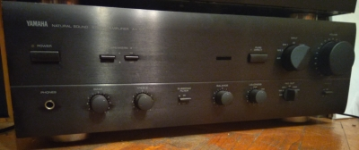
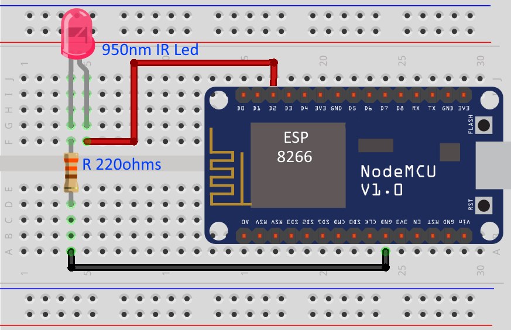

# Yamaha AX 570 Amp - Web Remote (ESP8266)
Control your amp over network only with ESP8266 and code found in web site.  

If you have purchase a Yamaha ax 570 amp without the remote, no panic ! With this repo, you will be able to control him with your phone over network

# You will need

>Software:
   * ArduinoIDE (with instaled ESP8266 Board) - [Read How Here](https://randomnerdtutorials.com/how-to-install-esp8266-board-arduino-ide/).
   * If you need another IR code for your web remote, you can found a bunch of [these](http://lirc-remotes.sourceforge.net/remotes-table.html).
   * Library - [WiFiManager](https://github.com/tzapu/WiFiManager) - Espressif ESPx WiFi Connection manager with fallback web configuration portal
   * Library - [IRremoteESP8266](https://github.com/crankyoldgit/IRremoteESP8266) - This library enables you to send and receive infra-red signals on an ESP8266 or an ESP32 using the Arduino framework using common 940nm IR LEDs and common IR receiver modules. e.g. TSOP{17,22,24,36,38,44,48}* demodulators etc.
  
>Hardware:

* x1 ESP8266 (NodeMcu 1.0/ESP12-12E)
* x1 950nm IR Led
* x1 220ohms resistor
* x1 Power supply for ESP8266

# Schematic 

# Steps
1. Prepare ArduinoIDE
  * Install ESP8266 Board - [Read How here](https://randomnerdtutorials.com/how-to-install-esp8266-board-arduino-ide/).
  * Install WifiManager - [Read how here](https://github.com/tzapu/WiFiManager#install-through-library-manager).
  * Install IRremoteESP8266 - [Read how here](https://github.com/crankyoldgit/IRremoteESP8266#installation)
2. Open source code with ArduinoIDE and upload code to ESP8266
3. Connect the IR-Led to the module(ESP8266)

# End Result

